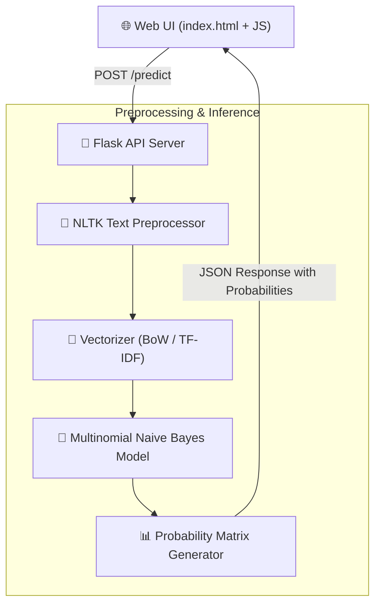
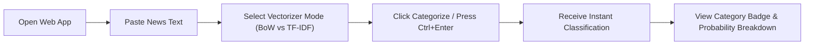
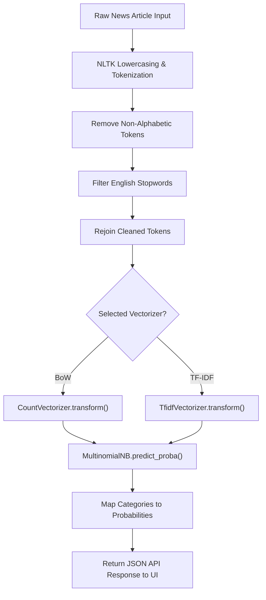
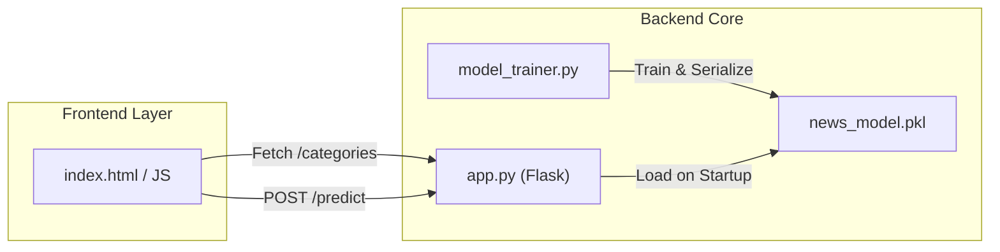

<div align="center">

# 📰 News Article Categorizer

> Machine Learning-powered news article classification platform using Multinomial Naive Bayes, NLTK, and Flask.


</div>

---

## 📑 Table of Contents

- [Project Overview](#-project-overview)
- [Key Features](#-key-features)
- [Dataset](#-dataset)
- [Architecture](#-architecture)
- [Setup Guide](#-setup-guide)
- [API Documentation](#-api-documentation)
- [Future Improvements](#-future-improvements)
- [License](#-license)

---

## 📖 Project Overview

Media outlets and content aggregators process thousands of unstructured news articles daily. Manually sorting these articles into relevant domains is time-consuming, prone to human error, and delays real-time news delivery to readers.

**News Article Categorizer** solves this problem by automating text classification using Natural Language Processing (NLP) and Machine Learning. Powered by a Multinomial Naive Bayes model trained on the BBC News dataset, it processes raw news headlines or full-length articles, converts them into Bag-of-Words (BoW) or TF-IDF feature vectors, and returns instant predictions with category probability distributions across 5 key domains.

---

## ✨ Key Features

- **Multi-Category Classification** — Automatically classifies text into 5 distinct categories: **Business**, **Entertainment**, **Politics**, **Sport**, and **Tech**.
- **Dual Vectorization Engines** — Supports both **Bag of Words (BoW)** and **TF-IDF** (Term Frequency-Inverse Document Frequency) feature extraction models.
- **High-Accuracy ML Model** — Utilizes Multinomial Naive Bayes trained on authentic news corpora, delivering high classification precision.
- **NLTK Text Preprocessing** — Includes automated tokenization, case normalization, non-alphabetic filtering, and English stopword removal.
- **Probability Distribution Breakdown** — Calculates and displays confidence percentages for all supported news categories.
- **Interactive Web Interface** — Responsive frontend with category badge color-coding, animated probability progress bars, and keyboard shortcuts (`Ctrl + Enter`).
- **Standalone Model Trainer** — Includes a `model_trainer.py` script to retrain models, evaluate classification metrics, and serialize trained artifacts to disk.

---

## 📊 Dataset

### 7.1 Dataset Overview

The system uses the **BBC News Dataset**, a widely recognized text classification benchmark comprising raw news articles from 5 topical domains. It provides a balanced distribution of real-world journalism text suitable for training and validating NLP models.

### 7.2 Dataset Source

| Dataset | Purpose | Source |
|:---|:---|:---|
| BBC News Train Dataset | Model training & cross-validation | `BBC News Train.csv` (BBC / Kaggle Benchmark) |
| BBC News Test Dataset | Model evaluation & out-of-sample testing | `BBC News Test.csv` |

### 7.3 Dataset Structure

| Feature | Description |
|:---|:---|
| `ArticleId` | Unique numeric identifier for the news record |
| `Text` | Full text body of the news article or headline |
| `Category` | Target variable (`business`, `entertainment`, `politics`, `sport`, `tech`) |

### 7.4 Data Preprocessing

1. **Text Normalization** — Converts input text to lowercase.
2. **Tokenization** — Splits text into individual word tokens using `nltk.word_tokenize`.
3. **Punctuation & Digit Removal** — Filters out non-alphabetic characters using `.isalpha()`.
4. **Stopword Filtering** — Removes common English stopwords (e.g., *the, is, at*) via NLTK corpus.
5. **Feature Vectorization** — Converts cleaned tokens into numerical sparse matrices using `CountVectorizer` or `TfidfVectorizer`.

### 7.5 Dataset Statistics

- **Total Records**: 1,490+ labeled training articles
- **Categories**: 5 (`business`, `entertainment`, `politics`, `sport`, `tech`)
- **Train / Test Split**: 80% Training / 20% Testing
- **File Format**: CSV

### 7.6 Dataset Download

The dataset is included directly in the root folder (`BBC News Train.csv` and `BBC News Test.csv`). You can also obtain it from Kaggle's [BBC News Classification Benchmark](https://www.kaggle.com/c/learn-ai-bbs-news-classification).

---

## 🏗️ Architecture

### 8.1 System Architecture

The application adopts a decoupled Flask backend architecture. The NLTK preprocessing module sanitizes incoming text, which is then vectorized using serialized `CountVectorizer` or `TfidfVectorizer` objects. The `MultinomialNB` model processes the sparse matrix to calculate predictions and probability scores, serving JSON responses to the frontend.



### 8.2 User Journey



### 8.3 Pipeline Flow



### 8.4 Component Interaction



---

## ⚙️ Setup Guide

### 8.1 Prerequisites

| Software | Version | Required |
|:---|:---|:---|
| Python | 3.8+ | ✅ |
| pip | Latest | ✅ |
| Git | Any | ✅ |

### 8.2 Project Structure

```text
news_categorizer/
├── app.py                  # Flask web application & API server
├── model_trainer.py        # ML training, evaluation, & serialization script
├── train_model.bat         # Windows batch script for automated training
├── news_model.pkl          # Serialized model artifact (generated)
├── requirements.txt        # Python package dependencies
├── BBC News Train.csv      # Labeled training dataset
├── BBC News Test.csv       # Evaluation test dataset
├── static/                 # Stylesheets & static assets
│   └── style.css           # UI layout & responsive styling
└── templates/
    └── index.html          # Main HTML interface template
```

### 8.3 Environment Variables

| Variable | Description | Default | Required |
|:---|:---|:---|:---|
| `FLASK_ENV` | Environment mode (`development`/`production`) | `development` | Optional |
| `PORT` | Web server port number | `5000` | Optional |

### 8.4 Installation Guide

```bash
# 1. Clone the repository
git clone https://github.com/yourusername/news-categorizer.git
cd "news categorizer"

# 2. Create and activate a virtual environment
python -m venv venv
# Linux/macOS: source venv/bin/activate
# Windows: venv\Scripts\activate

# 3. Install dependencies
pip install -r requirements.txt

# 4. Train the ML model and generate news_model.pkl
python model_trainer.py

# 5. Start the Flask application
python app.py
```

### 8.5 Five-Minute Quick Start

1. Run `python model_trainer.py` to train and save the classifier artifact (`news_model.pkl`).
2. Run `python app.py` to start the Flask server.
3. Open `http://127.0.0.1:5000` in your web browser.
4. Paste any news headline or paragraph (e.g., *"Apple announces new AI chips for MacBook Pro"*).
5. Choose your vectorization method (**Bag of Words** or **TF-IDF**).
6. Click **Categorize News** (or press `Ctrl + Enter`) to see the predicted topic and category probabilities!

---

## 📡 API Documentation

### 9.1 Authentication

Not Applicable. The Flask API is open for public local access without authentication tokens.

### 9.2 API Endpoints

| Method | Endpoint | Description |
|:---|:---|:---|
| `GET` | `/` | Renders the main web interface |
| `POST` | `/predict` | Classifies news text and returns category probabilities |
| `GET` | `/categories` | Returns a JSON array of all supported news categories |

### 9.3 Error Responses

| Code | Meaning |
|:---|:---|
| `200` | Success |
| `400` | Bad Request — No text or empty text string provided |
| `500` | Internal Server Error — Model artifact missing or invalid processing |

### 9.4 Usage Guide

Example API prediction request using `cURL`:

```bash
curl -X POST http://127.0.0.1:5000/predict \
  -H "Content-Type: application/json" \
  -d '{
    "text": "The national team won the championship match in extra time.",
    "model_type": "tfidf"
  }'
```

Example JSON response:

```json
{
  "success": true,
  "prediction": "sport",
  "probabilities": {
    "sport": 0.942,
    "entertainment": 0.021,
    "business": 0.015,
    "politics": 0.012,
    "tech": 0.010
  },
  "text": "The national team won the championship match in extra time."
}
```

### 9.5 Deployment Guide

Deploy using **Gunicorn** on platforms like Render or Railway:

```bash
pip install gunicorn
gunicorn app:app --bind 0.0.0.0:5000
```

---

## 🚀 Future Improvements

- 🤖 **Transformer Model Integration** — Implement fine-tuned BERT/RoBERTa for higher contextual accuracy
- 🌐 **Live Web Scraper** — Add a URL input feature to auto-scrape and classify news articles from online URLs
- 🌍 **Multi-Language Support** — Expand classification capabilities to support multi-lingual news sources
- 📊 **Advanced Analytics Dashboard** — Visual tracking of historical prediction trends and category metrics
- ⚡ **FastAPI Migration** — Refactor backend to FastAPI for asynchronous processing and automatic OpenAPI specs
- 📦 **Dockerization** — Package application into containerized environment for quick cloud deployments
- 🏷️ **Sub-Category Tagging** — Extend hierarchy to classify specific sub-topics (e.g., *Tech ➔ Cybersecurity*)
- 🧪 **Automated Testing Suite** — Add `pytest` unit tests for text processing functions and API endpoints

---

## 📄 License

This project is licensed under the **MIT License** — see the [LICENSE](LICENSE) file for details.

---

<div align="center">

**Built with ❤️ using Python, Scikit-Learn, NLTK, and Flask**

</div>
